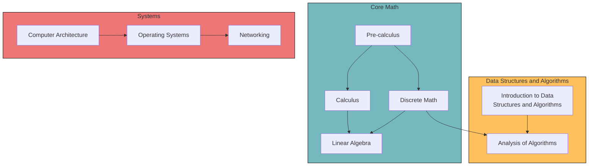

# Self Study CS

## Introduction

A collection of books, resources, and courses for self-studying Computer Science.

## Who is this for?

I've made this curriculum for people like myself, who are already working as software development professionals and/or have some programming experience, but wish to round out their computer science fundamentals. I made this mostly for myself, but anyone else who may find it useful is welcome to use it / make it their own.

This curriculum is *not* for those looking to quickly career change to a job in software development. These resources are thorough and often more rigorous than one would likely need to get an entry-level job in software development. This isn't to say that going through these resources is not beneficial for a career in software, but it is most definitely not the quickest path to change careers. For those looking to change careers into software development, I recommend the [coding-interview-university](https://github.com/jwasham/coding-interview-university) or [OSU Postbacc in Computer Science](https://eecs.oregonstate.edu/academic/online-cs-postbacc).

## Guiding principals

I built this curriculum with these principals in mind.

+ **Quality over quantity** - A focus on quality, well respected learning material - not a giant, thrown together list of articles, MOOCs, and videos.
+ **Textbooks over MOOCs where possible** - A preference for well regarded textbooks & university lectures over MOOCs1.
+ **Fundamentals** - A focus on CS fundamentals, not on "what's hot right now."
+ **Core math included** - CS is, at its core, a branch of applied mathematics.  This curriculum treats it as such.
+ **Suitable for self instruction** - Materials are convenient, effective, and easy to consume for the motivated self-learner.

1 MOOCs are great and have their place, but often lack rigor, vary in quality, and can be taken down / changed without warning. When MOOCs are used in this curriculum, they are produced by well-regarded universities.

## References

Much of this curriculum was heavily inspired by the resources from [teachyourselfcs.com](https://teachyourselfcs.com/). I highly recommend checking it out.

## How to use this curriculum

For each subject, there will be a textbook and in some cases associated video series (usually YouTube). Do your best to work through the entire textbook and do practice problems where applicable. Use the videos to supplement your learning.

## Curriculum

| Subject Area | Subject | Book | Video |
| ------------ | ------- | ---- | ----- |
| Core Math | Pre-calculus | [Openstax: Algebra & Trigonometry, Abramson 2e](https://openstax.org/details/books/algebra-and-trigonometry-2e) | [Professor Leonard's Precalculus - College Algebra/Trigonometry YouTube Playlist](https://www.youtube.com/playlist?list=PLDesaqWTN6ESsmwELdrzhcGiRhk5DjwLP) |
| Core Math | Calculus | [Openstax: Calculus: Volume 1, Strang & Herman](https://openstax.org/details/books/calculus-volume-1) | [Professor Leonard's Calculus 1 YouTube Playlist](https://www.youtube.com/watch?v=fYyARMqiaag&list=PLF797E961509B4EB5) |
| Core Math | Discrete mathematics | [Discrete Mathematics with Applications, Epp](https://www.amazon.com/Discrete-Mathematics-Applications-Susanna-Epp/dp/0495391328) | - |
| Core Math | Linear algebra | [A First Course in Linear Algebra, Beezer](http://linear.ups.edu/index.html) | [3blue1brown Essence of Linear Algebra](https://www.3blue1brown.com/topics/linear-algebra) |
| Data Structures & Algorithms | Introduction to Data Structures and Algorithms | [Algorithms, Sedgewick and Wayne](https://algs4.cs.princeton.edu/home/) | [Coursera Algorithms Part 1](https://www.coursera.org/learn/algorithms-part1) |
| Data Structures & Algorithms | Analysis of Algorithms |
| Software Engineering | Programming |
| Software Engineering | Software Development |
| Systems | Computer Architecture |
| Systems | Operating Systems |
| Systems | Networking |
| Programming Languages | Programming Languages & Compilers |
| Distributed Systems | Distributed Systems & Databases |

## Prerequisites

